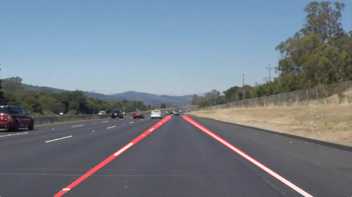

# Finding Lane Lines on the Road 

When we drive, we use our eyes to decide where to go.  The lines on the road that show us where the lanes are act as our constant reference for where to steer the vehicle.  Naturally, one of the first things we would like to do in developing a self-driving car is to automatically detect lane lines using an algorithm.

In this project you will detect lane lines in images using Python and OpenCV. 

The project is contained in the notebook `P1.ipynb`.

# Dependencies 

Python 3 along with the numpy, matplotlib, and OpenCV libraries, as well as Jupyter Notebook. 
